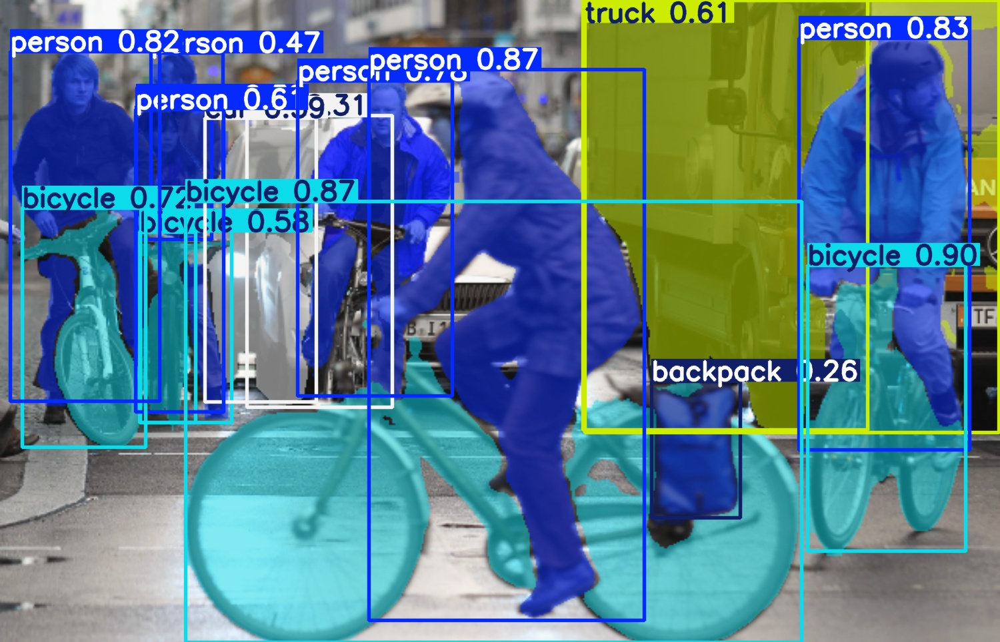
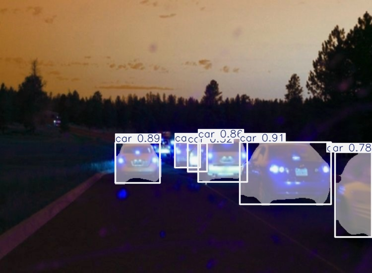

# Image-Segmentation-AWS-MLOps

# YOLOv11 Object Detection & Segmentation with FastAPI and AWS

This repository demonstrates a robust implementation of real-time object detection and segmentation using the YOLOv11 segmentation model, integrated with FastAPI for serving the API. The application is containerized with Docker and deployed via AWS (ECR and EC2), complete with Continuous Integration and Continuous Deployment (CI/CD) through GitHub Actions.

---

## 🚀 Features
- **Real-time Object Detection and Segmentation** with YOLOv11
- **REST API** built using FastAPI
- **Dockerized application** for portability and scalability
- **CI/CD Pipeline** with GitHub Actions, AWS ECR, and EC2
- User-friendly **web interface** to upload images and visualize predictions

---

## 📸 Example Results
### 🖼 Input vs. Output Comparison
<p align="center">
  
  
</p>
<p align="center">
  
  
</p>

---

## 📂 Project Structure
```bash
.
├── app.py                    # FastAPI application backend
├── Dockerfile                # Docker build configuration
├── requirements.txt          # Python dependencies
├── static/                   # Directory to store prediction results
├── templates/                # HTML frontend
│   └── index.html
├── uploads/                  # Temporary storage for uploaded images
└── .github/workflows/
    └── deploy.yml            # GitHub Actions CI/CD configuration
```

---

## 🛠 Installation & Setup

### 🛠️ Local Setup

**1. Clone the repository:**
```bash
git clone https://github.com/vedantchavan004/Image-Segmentation-AWS-MLOps.git
cd Image-Segmentation-AWS-MLOps
```

**2. Setup Virtual Environment:**
```bash
python -m venv venv
source venv/bin/activate   # Linux/MacOS
venv\Scripts\activate      # Windows
```

**3. Install Dependencies:**
```bash
pip install -r requirements.txt
```

**3. Run the FastAPI server locally:**
```bash
uvicorn app:app --host 127.0.0.1 --port 8000 --reload
```

**4. Open the application in your browser:**
```bash
http://127.0.0.1:8000
```

---

## ☁️ Deployment (AWS & GitHub Actions)

This project uses GitHub Actions for automatic deployment. Each push to the `main` branch triggers:
- Docker image build
- Push Docker image to AWS ECR
- Deployment to AWS EC2 instance

### 🔑 GitHub Actions Secrets Required:
| Secret Name | Description |
|-------------|-------------|
| `AWS_ACCESS_KEY_ID` | AWS IAM User Access Key |
| `AWS_SECRET_ACCESS_KEY` | AWS IAM User Secret Key |
| `AWS_REGION` | AWS Region (e.g., `eu-central-1`) |
| `AWS_ACCOUNT_ID` | AWS Account ID |
| `EC2_SSH_PRIVATE_KEY` | SSH Private Key for EC2 (contents of `.pem` file) |
| `YOUR_EC2_PUBLIC_IP` | Public IP address of your EC2 instance |

---

## 🖥️ Deployment Architecture
- **FastAPI Application:** Hosted on AWS EC2
- **Docker Container:** Pulled from AWS Elastic Container Registry (ECR)
- **Continuous Deployment:** Automated via GitHub Actions

---

## 🛠️ Tech Stack
- **Backend:** FastAPI, Python
- **AI Model:** YOLOv11 Segmentation (Ultralytics)
- **Containerization:** Docker
- **Cloud Services:** AWS EC2, AWS ECR
- **CI/CD:** GitHub Actions

---

## 🙌 Contributing
Contributions, issues, and feature requests are welcome! Feel free to check the issues page.

---

## 📄 License
This project is licensed under the MIT License.

---

## 📬 Contact
- [Vedant Sanjay Chavan](https://vedantsanjaychavan.de)
- LinkedIn: [Vedant Chavan](https://www.linkedin.com/in/vedant-chavan-97ml)

⭐ **Happy coding!** 🚀

